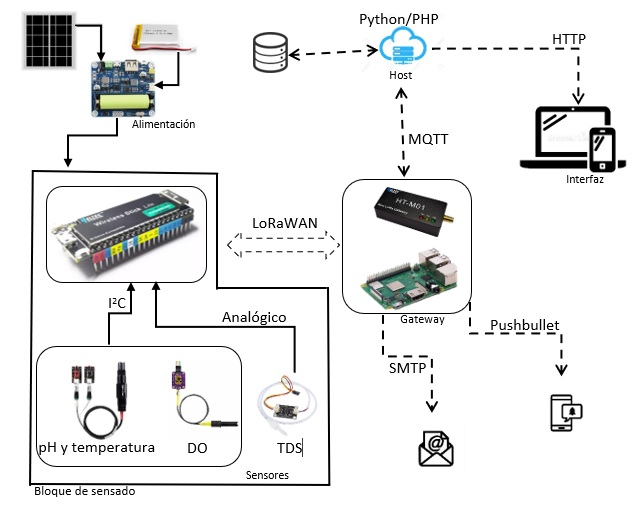

# Design and development of a water quality measurement prototype for aquaculture production

This project presents the development of a system for monitoring and data collection. The system is composed of a device for measuring parameters related to a phenomenon of interest called end device, a gateway that is in charge of receiving the data, an application server that stores, displays and triggers alarms if necessary, and a network server that coordinates the gateway and the application server. As a demonstration of the system, a fish farm water quality monitoring application is shown, however, the proposed system is general purpose, and can be used in a wide variety of IoT applications.

## System operation

The block diagram of the project can be seen in the following figure. 

The diagram shows that the sensing block is powered by solar panels or rechargeable batteries.
In this block, the Wireless Stick Lite board is in charge of controlling and collecting the information from the sensors through the i2c communication protocol and through an analog channel. Once the information is collected, it is transmitted from the control board to the gateway using the LoRaWAN protocol. 

The HT-M01 module controlled through a Raspberry Pi 3B+ was used as the gateway. The ChirpStack network server stack was also installed on the computer to carry out the LoRaWAN network implementation. The ChirpStack stack is responsible for sharing the information received from the sensing block to the host so that the host can process it. Chirpstack uses the MQTT protocol to communicate the data.

The host is in charge of processing the information through a Python script. If any irregularity is found in the data received, a digital alert is triggered and sent via email through the SMTP protocol or it can also be sent via push notification using the Pushbullet application. Additionally, the host is responsible for storing the information in a database and hosts a web page through which the data can be consulted in real time.

The web page was built using the adminLTE template as a base, together with HTML, CSS, native PHP, JavaScript, MariaDB technologies and phpMyAdmin was used as database manager. 

## Implementation
The water quality monitoring system developed in this work was implemented and evaluated in experimental shrimp, abalone, striped bass, koi carp and pismo clams farms located in the CICESE. Measurements were taken every minute, obtaining about 1440 samples per day versus two that are usually taken manually in these cultures. 
